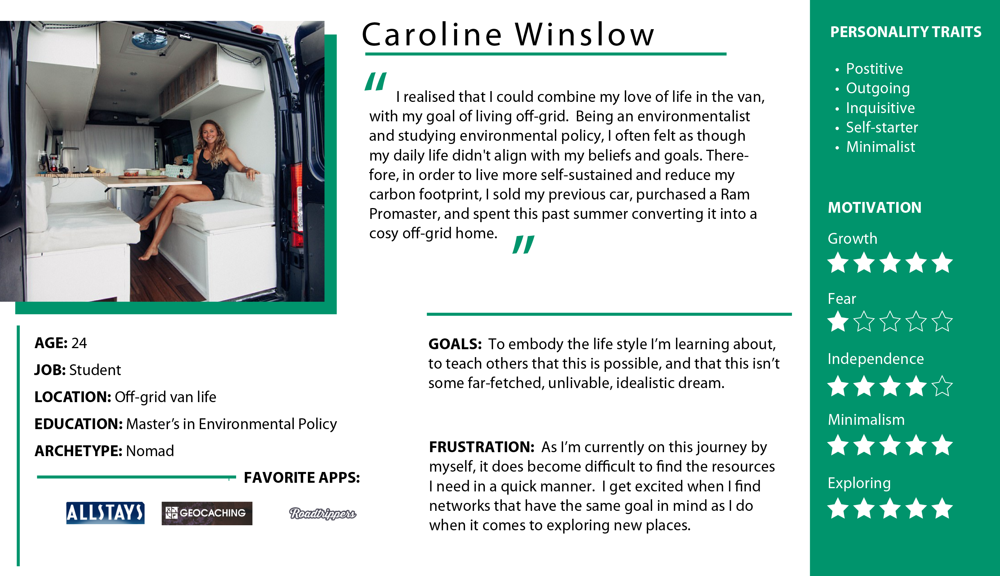

# Holiday Road from Nashville

## Description

As a team we were contracted by the National Parks Service to build an application that will allow people to build itineraries for their trips to the beautiful national parks that they maintain. The starting point of each trip will be Nashville, TN, but the destination will a national park selected by the user. In addition, they would like to include a list of eateries and attractions along the way.

This was our first full, professional Sprint. We did daily scrum stand-ups, where we provided a concise status update on our own work. Took part in a retrospective, where the team reflected on the work done, the team dynamics and discussed to to improve in the future.

## Requirements
1. When PR is submitted, must sit with team member and review all of the code.
1. Use Javascript
1. Use GitHub
1. Use multiple APIs to gather data
1. Use Scrum framework for agile development


## Feature List

### Building the Itinerary

* List all national parks in a dropdown. When user chooses one, display the name of the park in the **Itinerary Preview** section.

* List all bizarraries in a dropdown. When user chooses one, display the name of the bizarre attraction in the **Itinerary Preview** section.

* List all eateries in a dropdown. When user chooses one, display the name of the eatery in the **Itinerary Preview** section.

### Itinerary Details

* In the **Itinerary Preview** section, there should be a button labeled _Save Itinerary_. It should be disabled by default.
* When the user has selected a park, and the name of the park has been added to the **Itinerary Preview** section, query the Open Weather API and display the 5 day forecast for that location. This will allow the user to see if they want to make the trip soon.
* When the user adds any item to the **Itinerary Preview**, there should be a _Details_ button next to the name of the item.

* When the user clicks on any detail button for an itinerary item, a dialog box should be presented to the user with more information about that item _(description, address, etc...)_.
* Once the user has selected a park, a bizarre attraction, and an eatery, the _Save Itinerary_ button should be enabled.
* When the user clicks the _Save Itinerary_ button, the chosen items should be saved as an object in your own, local API that is managed by `json-server`. Each saved itinerary should appear in an aside bar on the right side of the UI.

## Installation: 
You will need to serve up the page from the main folder. 
From the api folder run:  
```json-server -p 8090 -w db.json```


## API Keys
Make a copy of the `Settings.js.example` file in the scripts folder and call this file `Settings.js`. Insert your NPS and Weather API keys into appropriately named double quotes. All API keys below will be saved in `Settings.js`


## National Park Service API

* API home: https://www.nps.gov/subjects/digital/nps-data-api.htm
* API documentation: https://www.nps.gov/subjects/developer/api-documentation.htm

### List All Parks

https://developer.nps.gov/api/v1/parks?api_key=your_api_key

## Weather API

https://openweathermap.org/api

## Bizarre Destination

http://holidayroad.nss.team/bizarreries

## Eateries Destination

http://holidayroad.nss.team/eateries


## Persona
Used persona descibed below to cater to their specific needs. Weather conditions, restroom accessibility and wifi service are all a vital part of the VanLife.

### Caroline



## Wireframe 


## ERD


## Visuals


